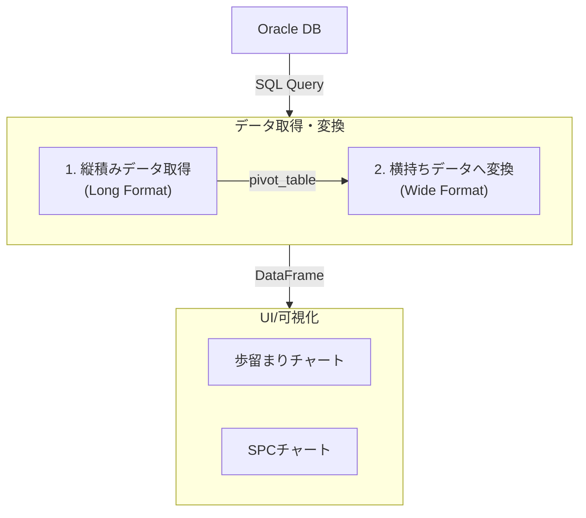

# 📈 半導体製造データダッシュボード

このダッシュボードは、半導体製造プロセスで発生する歩留まりやWAT（ウェーハ受け入れテスト）のデータを可視化・分析するためのStreamlitアプリケーションです。

---

## ✨ 主な機能

-   **📊 インタラクティブな可視化**: Lot別、Wafer別のドリルダウン分析や、カスタマイズ可能なSPCチャートを提供。
-   **🔌 柔軟なデータソース**: Oracleデータベース（本番）とローカルCSV（開発）の両方に対応。
-   **🔐 安全な認証情報管理**: StreamlitのSecrets機能を利用し、データベースの接続情報を安全に管理。
-   **🧩 モジュール化設計**: 機能ごとにコードが整理されており、メンテナンスと機能追加が容易です。
-   **⚡ 動的なSQLクエリ**: 製品の特性（例: Fail-Stop品）に応じて、実行するSQLクエリを自動で切り替え。

---

## 🚀 実行方法

1.  **リポジトリをクローンします。**

2.  **必要なライブラリをインストールします。**
    ```bash
    # uvを使っている場合
    uv pip install -r requirements.txt
    ```

3.  **データベース接続情報を設定します。（本番モードの場合）**
    `.streamlit/secrets.toml` ファイルを作成し、以下の内容を記述します。このファイルはGitの管理対象外です。
    ```toml
    # .streamlit/secrets.toml
    [database]
    username = "your_username"
    password = "your_password"
    dsn = "your_oracle_host:1521/your_service_name"
    ```

4.  **アプリケーションを起動します。**
    ```bash
    streamlit run main.py
    ```

---

## 🔧 アーキテクチャと設計

### ディレクトリ構成

```
/
├── .streamlit/          # Streamlit設定 (secrets.toml, config.toml)
├── data/                # 開発用のCSVデータ
├── pages/               # 各ページのUI定義
│   ├── 1_Yield_Prod.py  # 本番用: 歩留まりページ
│   └── 2_WAT_SPC_Dev.py # 開発用: WAT/SPCページ
├── src/                 # アプリケーションのコアロジック
│   └── modules/
│       ├── db_utils.py      # DB接続とデータ変換ロジック
│       ├── sql_queries.py   # SQLクエリの一元管理
│       ├── yield_charts.py  # 歩留まりチャート生成
│       └── ...
└── main.py              # アプリケーションのホームページ
```

### データの流れ (本番モード)

本アプリケーションの核心は、データベースから取得した正規化された「**縦積みデータ**」を、分析に適した「**横持ちデータ**」へ動的に変換する点にあります。この処理は歩留まり(Yield)と電気特性(WAT)の両方で共通化されています。



1.  `db_utils.py` が `sql_queries.py` からSQLクエリを読み込み、DBから縦積みデータを取得します。
2.  取得したデータは、`pandas.pivot_table` によって横持ちデータに変換されます。
    -   **歩留まり**: 各ウェーハのBIN毎の**個数を集計**します。
    -   **WAT**: 各測定パラメータを**列に展開**します。
3.  変換されたDataFrameが各ページに渡され、チャートとして描画されます。

この設計により、データベースの物理スキーマとアプリケーションを疎結合に保ち、メンテナンス性を高めています。

---

## 🔌 データベース連携ガイド

連携を成功させるには、`src/modules/sql_queries.py` のSQLクエリを、お使いのデータベース環境に合わせて正しく設定する必要があります。

### A. 歩留まり (Yield) データ

-   **データ形式**: 1行が1ダイのテスト結果を表す「**縦積み**」で取得します。BIN番号を格納する列 (`Bin`) が必要です。
-   **SQLテンプレート**:
    ```sql
    -- sql_queries.py の YIELD_QUERY
    SELECT
        ...,
        TEST_BIN AS "Bin" -- テスト結果のBIN番号 (e.g., 1, 2, 3, ...)
    FROM YOUR_YIELD_TABLE
    ```
-   **動的クエリ選択**: 製品特性（例: Fail-Stop品）に応じて算出ロジックが異なる場合、`YIELD_QUERY_MAP` で使用するクエリをマッピングできます。

### B. WAT (電気特性) データ

-   **データ形式**: 1行が1つの測定値を表す「**縦積み**」で取得します。パラメータ名 (`Parameter`) と測定値 (`Value`) の列が必要です。
-   **SQLテンプレート**:
    ```sql
    -- sql_queries.py の WAT_QUERY
    SELECT
        ...,
        PARAMETER_NAME_COLUMN AS "Parameter", -- Vth, Idsatなどの名前が入る列
        VALUE_COLUMN AS "Value"              -- 1.23, 4.56などの測定値が入る列
    FROM YOUR_WAT_TABLE
    ```

### C. 規格値 (Spec) データ

-   WATパラメータの規格上限（USL）と下限（LSL）を定義します。WATデータと同様に、パラメータ名をキーにして値を取得します。

---

## 🌟 今後の拡張案 (Roadmap)

このダッシュボードをさらに発展させるためのアイデアです。

### 機能強化

-   **[認証・認可]** ユーザーログイン機能を導入し、ロール（管理者、エンジニア等）に応じた閲覧権限を付与する。
-   **[データ書き出し]** 表示しているデータをCSVやExcel形式でダウンロードできる機能を追加する。
-   **[アラート機能]** SPCルールから外れたロットや、歩留まりが閾値を下回った場合に、メールやSlackで自動通知する仕組みを構築する。
-   **[データ入力]** ダッシュボード上から特定のロットやウェーハに対してコメントやタグ（例: 「実験ウェーハ」）を付けられるようにする。

### パフォーマンス・運用

-   **[キャッシュ戦略の最適化]** 大量データに対応するため、`st.cache_data` のより高度な利用や、中間集計テーブルの活用を検討する。
-   **[CI/CDの導入]** GitHub Actionsなどを利用して、コードのテスト、Lint、デプロイを自動化する。
-   **[設定のUI化]** 現在はコードで管理しているSQLのマッピングや定数を、管理者向けのWeb UIから設定できるようにする。

### 分析機能の高度化

-   **[相関分析]** 複数のWATパラメータ間の相関を可視化する散布図などを追加する。
-   **[機械学習の導入]** 過去のデータから歩留まり低下の予兆を検知したり、異常なパラメータを自動で検出するモデルを組み込む。
