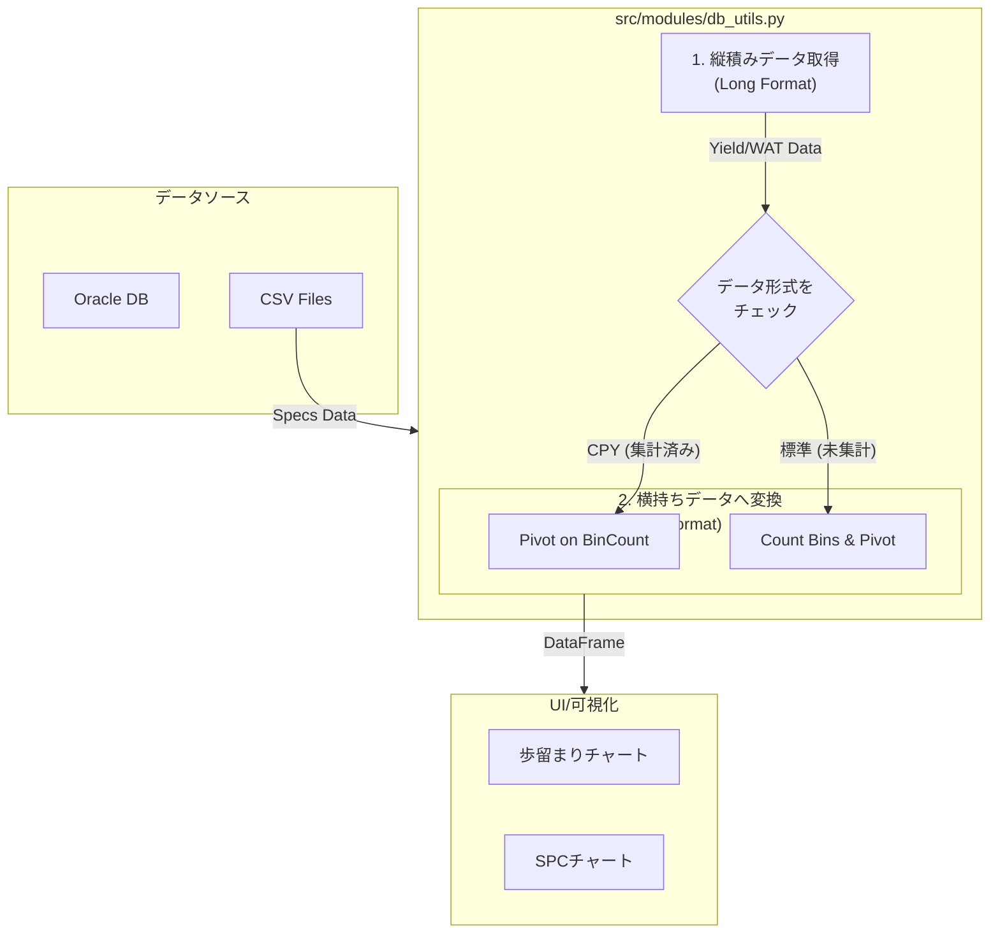

# 📈 半導体製造データダッシュボード

このダッシュボードは、半導体製造プロセスで発生する歩留まりやWAT（ウェーハ受け入れテスト）のデータを可視化・分析するためのStreamlitアプリケーションです。

---

## ✨ 主な機能

-   **📊 インタラクティブな可視化**: Lot別、Wafer別のドリルダウン分析や、カスタマイズ可能なSPCチャートを提供。
-   **🔌 柔軟なデータソース**: Oracleデータベース（本番）とローカルCSV（開発）の両方に対応。
-   **🔐 安全な認証情報管理**: StreamlitのSecrets機能を利用し、データベースの接続情報を安全に管理。
-   **🧩 モジュール化設計**: 機能ごとにコードが整理されており、メンテナンスと機能追加が容易です。
-   **⚡ 動的なSQLクエリ**: 製品の特性（例: Fail-Stop品）に応じて、実行するSQLクエリを自動で切り替え。

---

## 🚀 実行方法

1.  **リポジトリをクローンします。**

2.  **依存関係をインストールします。**
    `python-dotenv`が追加されたため、以下のコマンドで依存関係を更新・インストールしてください。
    ```bash
    # uvを使っている場合
    uv pip sync pyproject.toml
    ```

3.  **環境変数を設定します。**
    プロジェクトのルートディレクトリに `.env` という名前のファイルを作成し、データベースの接続情報を記述します。このファイルは `.gitignore` により、Gitの管理対象外となります。

    ```env
    # .envファイル
    DB_USERNAME="your_username"
    DB_PASSWORD="your_password"
    DB_DSN="(DESCRIPTION=(ADDRESS=(PROTOCOL=TCP)(HOST=your_oracle_host)(PORT=1521))(CONNECT_DATA=(SID=your_sid)))"
    ```

4.  **アプリケーションを起動します。**
    ```bash
    streamlit run main.py
    ```

---

## 🔧 アーキテクチャと設計

### ディレクトリ構成

```
/
├── .streamlit/          # Streamlit設定 (secrets.toml, config.toml)
├── data/                # 開発用のCSVデータ & 規格値(specs)ファイル
├── pages/               # 各ページのUI定義
│   ├── 1_Yield_Prod.py  # 本番用: 歩留まりページ
│   └── 2_WAT_SPC_Dev.py # 開発用: WAT/SPCページ
├── src/                 # アプリケーションのコアロジック
│   └── modules/
│       ├── db_utils.py      # DB接続とデータ変換ロジック
│       ├── sql_queries.py   # SQLクエリの一元管理
│       ├── yield_charts.py  # 歩留まりチャート生成
│       └── ...
└── main.py              # アプリケーションのホームページ
```

### データベースの前提条件

本番モードで動作させるには、アプリケーションが期待する特定のスキーマを持つOracleデータベースが必要です。

-   **テーブル**: クエリは `YOUR_SCHEMA.SEMI_CP_HEADER`, `YOUR_SCHEMA.SEMI_CP_BIN_SUM`, `YOUR_SCHEMA.WAT_HEADER` などのテーブルに依存しています。詳細は `src/modules/sql_queries.py` を参照してください。
-   **データ期間**: パフォーマンスと関連性を維持するため、すべてのクエリは `REGIST_DATE` に基づいて**過去6ヶ月**のデータのみを取得するように設定されています。

### データの流れ (本番モード)

本アプリケーションの核心は、データベースから取得した「**縦積みデータ**」を、分析に適した「**横持ちデータ**」へ動的に変換する点にあります。特に歩留まりデータは、製品の特性に応じて2種類の形式を処理できる設計になっています。



1.  **データ取得**: `db_utils.py` が、`sql_queries.py` で定義されたクエリを使い、歩留まり(Yield)とWATデータをDBから取得します。規格値(Specs)は `data/<product>/specs.csv` から読み込まれます。
2.  **歩留まりデータの変換**: `db_utils.py` は、取得した歩留まりデータに `BinCount` カラムが存在するかをチェックします。
    -   **存在する場合 (CPYデータ)**: データは既にBinごとに集計済みと判断し、`BinCount` の値をそのまま使って横持ちデータに変換します。
    -   **存在しない場合 (標準データ)**: データは未集計の生データと判断し、`pivot_table` を使って各Binの出現回数をカウントして横持ちデータに変換します。
3.  **WATデータの変換**: 縦積み形式のWATデータは、パラメータ名をカラムに変換する形で横持ちデータに変換されます。
4.  **可視化**: 変換されたDataFrameが各ページに渡され、インタラクティブなチャートとして描画されます。

### C. 規格値 (Spec) データ

-   **データソース**: **CSVファイル**
-   **パス**: `data/<product_name>/specs.csv`
-   WATパラメータの規格上限（USL）と下限（LSL）を定義します。製品ごとのフォルダに配置されたCSVファイルから読み込まれます。

---

## 🌟 今後の拡張案 (Roadmap)

このダッシュボードをさらに発展させるためのアイデアです。

### 機能強化

-   **[認証・認可]** ユーザーログイン機能を導入し、ロール（管理者、エンジニア等）に応じた閲覧権限を付与する。
-   **[データ書き出し]** 表示しているデータをCSVやExcel形式でダウンロードできる機能を追加する。
-   **[アラート機能]** SPCルールから外れたロットや、歩留まりが閾値を下回った場合に、メールやSlackで自動通知する仕組みを構築する。
-   **[データ入力]** ダッシュボード上から特定のロットやウェーハに対してコメントやタグ（例: 「実験ウェーハ」）を付けられるようにする。

### パフォーマンス・運用

-   **[キャッシュ戦略の最適化]** 大量データに対応するため、`st.cache_data` のより高度な利用や、中間集計テーブルの活用を検討する。
-   **[CI/CDの導入]** GitHub Actionsなどを利用して、コードのテスト、Lint、デプロイを自動化する。
-   **[設定のUI化]** 現在はコードで管理しているSQLのマッピングや定数を、管理者向けのWeb UIから設定できるようにする。

### 分析機能の高度化

-   **[相関分析]** 複数のWATパラメータ間の相関を可視化する散布図などを追加する。
-   **[機械学習の導入]** 過去のデータから歩留まり低下の予兆を検知したり、異常なパラメータを自動で検出するモデルを組み込む。
